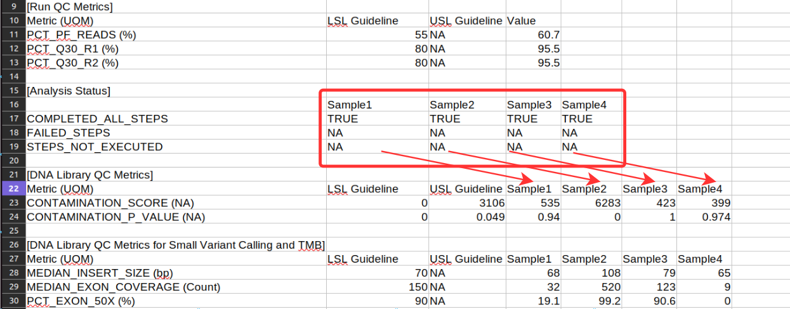
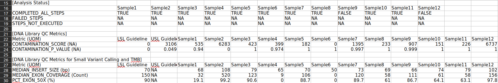
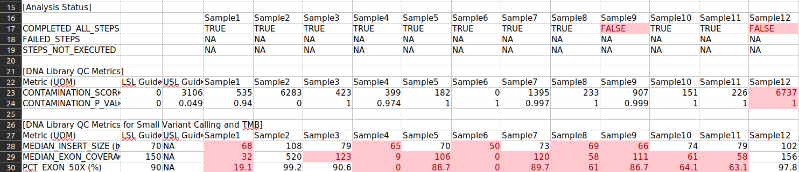

# Eggd MetricsOutput excel maker (DNAnexus Platform App)

## What does this app do?
This app produces the MetricsOutput.xlsx with relevant metrics highlighted per sample. Uses MetricsOutput.tsv file as input. 

## What inputs are required for this app?

### Required
- `tsv_input` (`file`) - A single MetricsOutput.tsv report generated from the eggd_tso500 app

### Optional
- `output_filename` (`str`) - a string to specify the filename for the .xlsx output. When not specified, filename 'MetricsOutput.xlsx' is used.

## How does this app work?
The app runs a python script to create an .xlsx file from the provided .tsv file and modifies the .xlsx file in accordance to the [Helios Manual][helios-manual]. The general outline is as follows:

- download the provided MetricsOutput.tsv file
- create an .xlsx file from the .tsv file
- make the following modifications on the first .xlsx worksheet called "MetricsOutput"
    -  move all cells of rows 16 to 19 and from column B 2 cells to the right. 
    - mark cells in red with 'FALSE'
    - mark cells in red for each sample when both Contamination score and p value is more than the Upper Specification Limit or lower than the Lower Specification Limits (LSL/USL).
    - mark cells in red for each sample column and for all DNA and RNA metrics that are outside the LSL/USL guidelines.

## What does this app output
Returns a .xlsx file with all the requested changes. As an example, the figures below depicts how the excel file looks before and after any modifications implemented.

- MetricsOutput file before any modifications:
- MetricsOutput file after any modifications:

## This app was created by East Genomics GLH
This is the source code for an app that runs on the DNAnexus Platform.
For more information about how to run or modify it, see
https://documentation.dnanexus.com/.

[helios-manual]: https://cuhbioinformatics.atlassian.net/wiki/spaces/O/pages/3082190955/Live+cancer+guides
